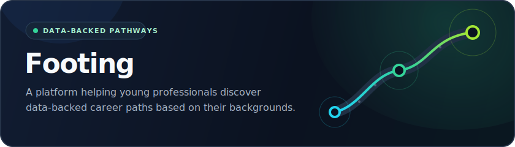

# Hi, I'm Ruitao 👋

I'm a product builder who uses conversations, data, and software to turn ambiguous problems into useful products.

### Currently building

### Tools I use

`Claude Code` · `Codex` · `Python` · `TypeScript` · `Swift` · `Supabase` · `AWS`

### Elsewhere

